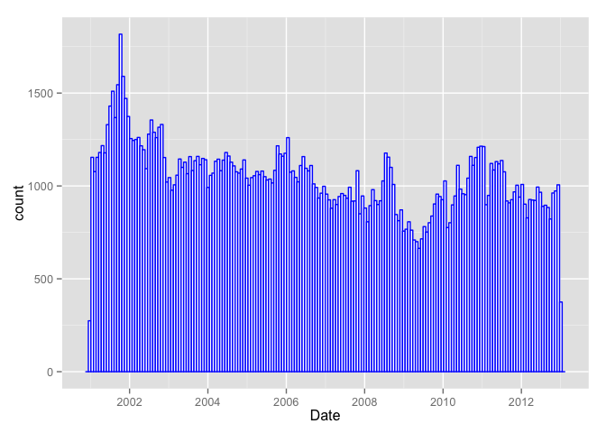
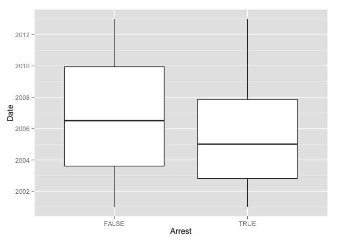

# assignment1_crimes
Steven Lin  
May 1, 2016  

# Setup


```r
library(data.table)
library(ggplot2)

main = "/Users/Steven/Documents/Professional/Data Science and Analytics/2_Courses"
course = "edX_Analytics_Edge"
datafolder = "Assignments/hw1"
setwd(file.path(main,course, datafolder))

data = fread("mvtWeek1.csv", na.strings = "NA", stringsAsFactors = FALSE)
head(data)
```

```
##         ID           Date           LocationDescription Arrest Domestic
## 1: 8951354 12/31/12 23:15                        STREET  FALSE    FALSE
## 2: 8951141 12/31/12 22:00                        STREET  FALSE    FALSE
## 3: 8952745 12/31/12 22:00 RESIDENTIAL YARD (FRONT/BACK)  FALSE    FALSE
## 4: 8952223 12/31/12 22:00                        STREET  FALSE    FALSE
## 5: 8951608 12/31/12 21:30                        STREET  FALSE    FALSE
## 6: 8950793 12/31/12 20:30                        STREET   TRUE    FALSE
##    Beat District CommunityArea Year Latitude Longitude
## 1:  623        6            69 2012 41.75628 -87.62164
## 2: 1213       12            24 2012 41.89879 -87.66130
## 3: 1622       16            11 2012 41.96919 -87.76767
## 4:  724        7            67 2012 41.76933 -87.65773
## 5:  211        2            35 2012 41.83757 -87.62176
## 6: 2521       25            19 2012 41.92856 -87.75400
```

# Problem 1: Loading the data


```r
# dim(data)
nrow(data) # number of rows
```

```
## [1] 191641
```

```r
ncol(data) # number of columns
```

```
## [1] 11
```

```r
summary(data) # get basic statistics for each variable
```

```
##        ID              Date           LocationDescription   Arrest       
##  Min.   :1310022   Length:191641      Length:191641       Mode :logical  
##  1st Qu.:2832144   Class :character   Class :character    FALSE:176105   
##  Median :4762956   Mode  :character   Mode  :character    TRUE :15536    
##  Mean   :4968629                                          NA's :0        
##  3rd Qu.:7201878                                                         
##  Max.   :9181151                                                         
##                                                                          
##   Domestic            Beat         District     CommunityArea  
##  Mode :logical   Min.   : 111   Min.   : 1.00   Min.   : 0     
##  FALSE:191226    1st Qu.: 722   1st Qu.: 6.00   1st Qu.:22     
##  TRUE :415       Median :1121   Median :10.00   Median :32     
##  NA's :0         Mean   :1259   Mean   :11.82   Mean   :38     
##                  3rd Qu.:1733   3rd Qu.:17.00   3rd Qu.:60     
##                  Max.   :2535   Max.   :31.00   Max.   :77     
##                                 NA's   :43056   NA's   :24616  
##       Year         Latitude       Longitude     
##  Min.   :2001   Min.   :41.64   Min.   :-87.93  
##  1st Qu.:2003   1st Qu.:41.77   1st Qu.:-87.72  
##  Median :2006   Median :41.85   Median :-87.68  
##  Mean   :2006   Mean   :41.84   Mean   :-87.68  
##  3rd Qu.:2009   3rd Qu.:41.92   3rd Qu.:-87.64  
##  Max.   :2012   Max.   :42.02   Max.   :-87.52  
##                 NA's   :2276    NA's   :2276
```

# Problem 2: Understanding Dates


```r
data[1,Date] # "12/31/12 23:15"
```

```
## [1] "12/31/12 23:15"
```

```r
DateConvert = as.Date(strptime(data[,Date], "%m/%d/%y %H:%M"))
DateConvert[1] # "2012-12-31"
```

```
## [1] "2012-12-31"
```

```r
summary(DateConvert) # median = "2006-05-21"
```

```
##         Min.      1st Qu.       Median         Mean      3rd Qu. 
## "2001-01-01" "2003-07-10" "2006-05-21" "2006-08-23" "2009-10-24" 
##         Max. 
## "2012-12-31"
```

```r
data[, c("Month", "Weekday") := list(months(DateConvert),weekdays(DateConvert))]
data[, Date:= DateConvert]

sort(table(data[, Month])) # February fewest crimes
```

```
## 
##  February     April     March      June       May   January September 
##     13511     15280     15758     16002     16035     16047     16060 
##  November  December    August      July   October 
##     16063     16426     16572     16801     17086
```

```r
sort(table(data[, Weekday])) # Friday most crimes
```

```
## 
##    Sunday   Tuesday  Saturday  Thursday    Monday Wednesday    Friday 
##     26316     26791     27118     27319     27397     27416     29284
```

```r
table(data[, list(Month, Arrest)])
```

```
##            Arrest
## Month       FALSE  TRUE
##   April     14028  1252
##   August    15243  1329
##   December  15029  1397
##   February  12273  1238
##   January   14612  1435
##   July      15477  1324
##   June      14772  1230
##   March     14460  1298
##   May       14848  1187
##   November  14807  1256
##   October   15744  1342
##   September 14812  1248
```

```r
sort(table(data[Arrest== TRUE, Month])) # January most crimes with an arrest
```

```
## 
##       May      June  February September     April  November     March 
##      1187      1230      1238      1248      1252      1256      1298 
##      July    August   October  December   January 
##      1324      1329      1342      1397      1435
```

# Problem 3: Visualizing Crime Trends


```r
ggplot(data, aes(x=Date)) + geom_histogram(color = "blue",
                                           fill = 'white',
                                           binwidth= 24)
```

 

```r
ggplot(data, aes(x = Arrest, y = Date)) + geom_boxplot()
```

 

```r
year_arrest = table(data[, list(Year, Arrest)]) 
prop.table(year_arrest, margin = 1) # propotion of arrests
```

```
##       Arrest
## Year        FALSE       TRUE
##   2001 0.89588272 0.10411728
##   2002 0.88721805 0.11278195
##   2003 0.89205739 0.10794261
##   2004 0.89959673 0.10040327
##   2005 0.90730405 0.09269595
##   2006 0.91912039 0.08087961
##   2007 0.91512605 0.08487395
##   2008 0.92938733 0.07061267
##   2009 0.93096080 0.06903920
##   2010 0.95476544 0.04523456
##   2011 0.96003070 0.03996930
##   2012 0.96097076 0.03902924
```

```r
year_arrest_prop = data.table(prop.table(year_arrest, margin = 1))
year_arrest_prop = year_arrest_prop[Arrest == TRUE, list(Year, N)]
```

# Problem 4: 


```r
location_counts = data[ LocationDescription != 'OTHER' , .N, by= LocationDescription]
top5_locations_freq = head(location_counts[order(N, decreasing=TRUE), ],5) # top 5 locations frequency
top5_locations_freq
```

```
##               LocationDescription      N
## 1:                         STREET 156564
## 2: PARKING LOT/GARAGE(NON.RESID.)  14852
## 3:                          ALLEY   2308
## 4:                    GAS STATION   2111
## 5:         DRIVEWAY - RESIDENTIAL   1675
```

```r
top5_locations = top5_locations_freq[,LocationDescription] # top 5 location names
top5 = data[LocationDescription %in% top5_locations] # subset of data with top5 locations
nrow(top5) # observations in top 5
```

```
## [1] 177510
```

```r
location_arrest = table(top5[, list(LocationDescription, Arrest)]) 
prop.table(location_arrest, margin = 1) # propotion of arrests, GAS STATION with higher proportion
```

```
##                                 Arrest
## LocationDescription                   FALSE       TRUE
##   ALLEY                          0.89211438 0.10788562
##   DRIVEWAY - RESIDENTIAL         0.92119403 0.07880597
##   GAS STATION                    0.79204169 0.20795831
##   PARKING LOT/GARAGE(NON.RESID.) 0.89206841 0.10793159
##   STREET                         0.92594083 0.07405917
```

```r
# Saturday most crimes in gas stations
table(top5[LocationDescription == 'GAS STATION',list(LocationDescription, Weekday)])
```

```
##                    Weekday
## LocationDescription Friday Monday Saturday Sunday Thursday Tuesday
##         GAS STATION    332    280      338    336      282     270
##                    Weekday
## LocationDescription Wednesday
##         GAS STATION       273
```

```r
# Saturday least crimes in residential driveway
table(top5[LocationDescription == 'DRIVEWAY - RESIDENTIAL',list(LocationDescription, Weekday)])
```

```
##                         Weekday
## LocationDescription      Friday Monday Saturday Sunday Thursday Tuesday
##   DRIVEWAY - RESIDENTIAL    257    255      202    221      263     243
##                         Weekday
## LocationDescription      Wednesday
##   DRIVEWAY - RESIDENTIAL       234
```


